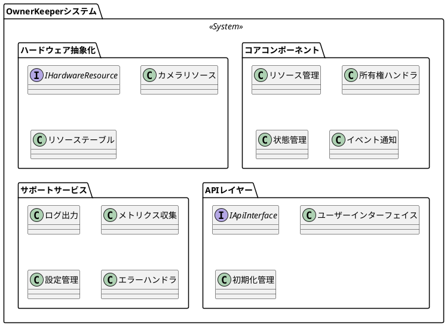
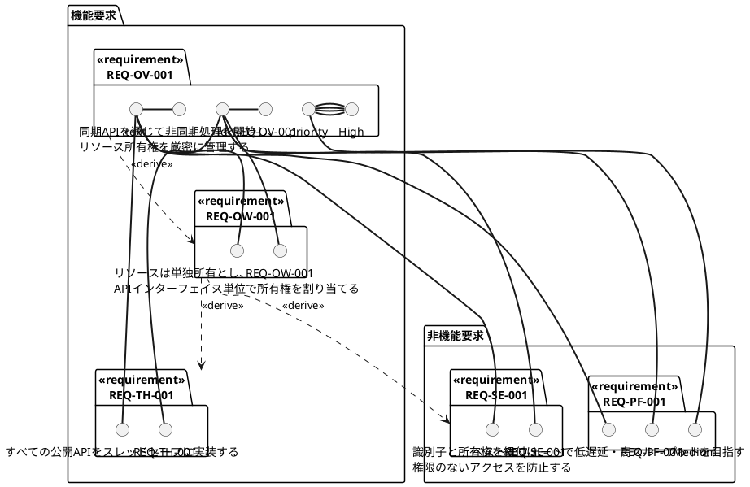
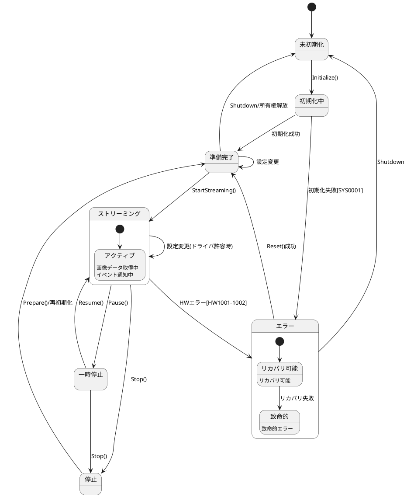
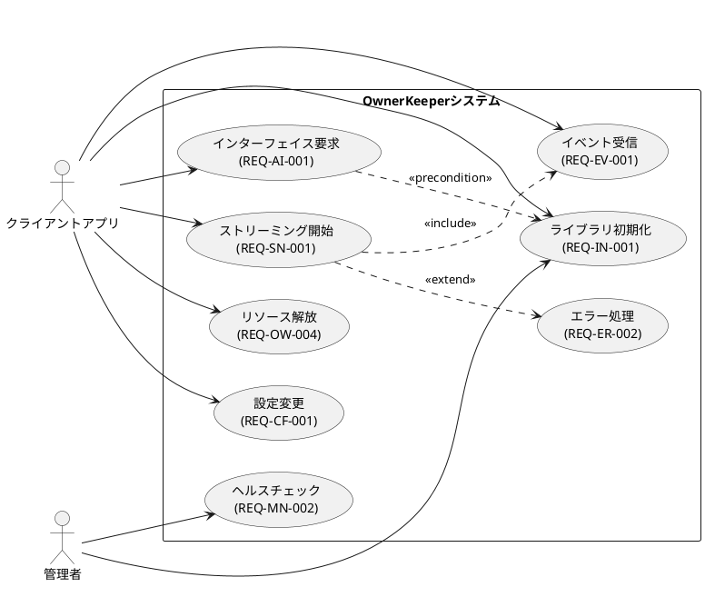
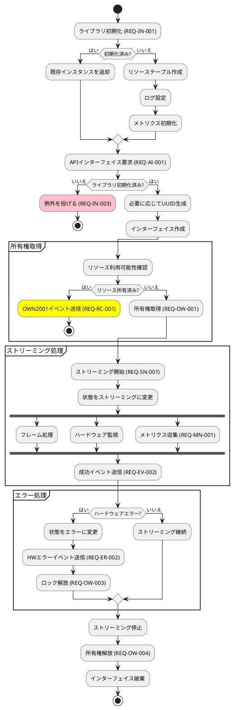
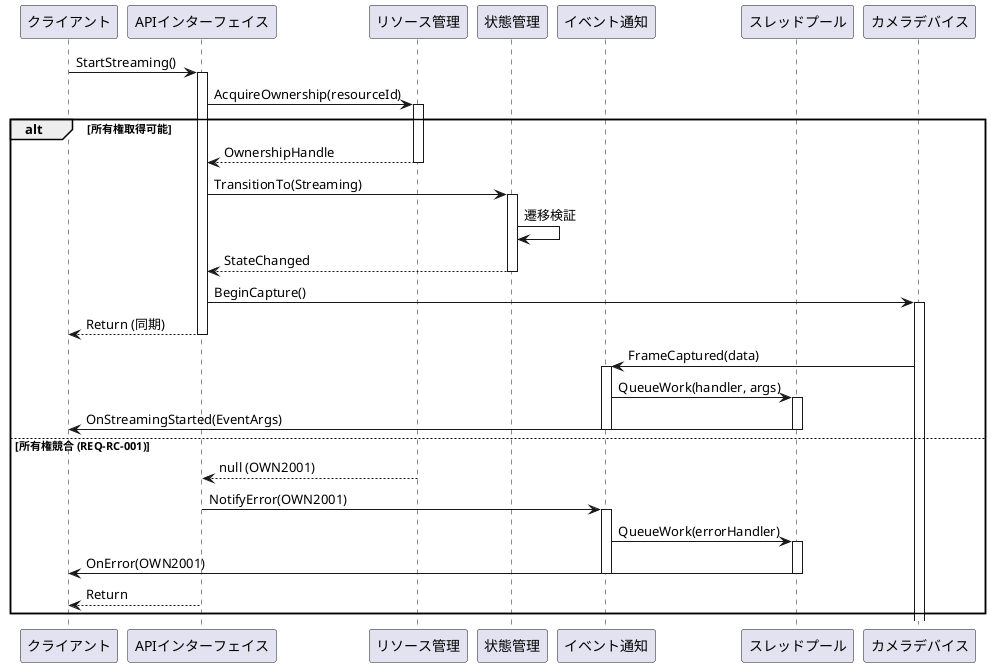
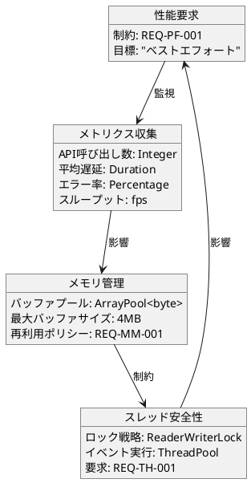
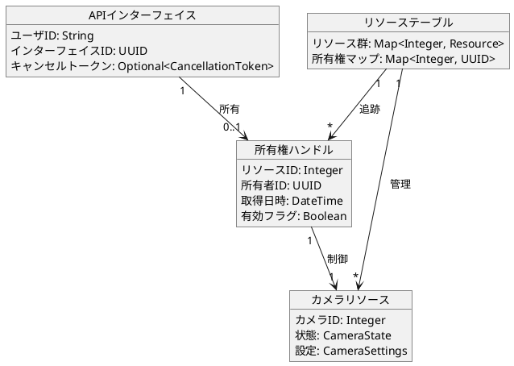

# OwnerKeeper 要件 - SysML分析

## 1. パッケージ図


## 2. 要求図


## 3. 状態機械図 (REQ-ST-001~004)


## 4. ブロック定義図
```plantuml
@startuml
block "OwnerKeeperライブラリ" <<block>> {
    part resourceManager : リソース管理
    part eventNotifier : イベント通知
    part logger : ログ出力

    port syncApi : ISyncApi
    port eventOut : IEventNotification
}

block "クライアントアプリ" <<external>> {
    port apiCall : IApiCall
    port eventReceiver : IEventReceiver
}

block "ハードウェアリソース" <<block>> {
    part camera : カメラデバイス
    port control : IHardwareControl
    port dataStream : IDataStream
}

"OwnerKeeperライブラリ".syncApi -- "クライアントアプリ".apiCall
"OwnerKeeperライブラリ".eventOut --> "クライアントアプリ".eventReceiver : <<flow>> イベント
"OwnerKeeperライブラリ" ..> "ハードウェアリソース".control : <<delegate>>
"ハードウェアリソース".dataStream --> "OwnerKeeperライブラリ" : <<flow>> データ
@enduml
```

## 5. ユースケース図


## 6. アクティビティ図 - カメラストリーミングフロー


## 7. シーケンス図 - イベント通知フロー


## 8. パラメトリック図 - 性能制約


## 9. 要求トレーサビリティマトリクス

| 要求ID | コンポーネント | 実装 | テスト戦略 |
|---------------|-----------|----------------|---------------|
| REQ-OV-001 | APIレイヤー | ISyncApiインターフェイス | 統合テスト |
| REQ-OV-002 | イベント通知 | デリゲートイベント | 単体テスト |
| REQ-OW-001 | リソース管理 | 所有権ハンドラ | 単体テスト |
| REQ-TH-001 | 全コンポーネント | スレッドセーフコレクション | 並行実行テスト |
| REQ-ST-001 | 状態管理 | State列挙型とFSM | 状態遷移テスト |
| REQ-ER-001 | APIレイヤー | 例外スロー | 単体テスト |
| REQ-ER-002 | イベント通知 | エラーイベント配信 | 統合テスト |
| REQ-MM-001 | リソース管理 | ArrayPool使用 | メモリリークテスト |
| REQ-SE-001 | APIレイヤー | 識別子バインディング | セキュリティテスト |

## 10. 内部ブロック図 - 所有権管理


## 分析サマリー

### 要件から導出される主要アーキテクチャ決定事項:

1. **所有権モデル (REQ-OW-001~004)**
   - リソース毎に単一所有権
   - インターフェイスベースの所有権管理
   - Dispose/Finalizerによる自動クリーンアップ

2. **並行実行戦略 (REQ-TH-001)**
   - 全APIスレッドセーフ
   - ThreadPool上でイベントハンドラ実行
   - 可能な限りロックフリー

3. **エラーハンドリング (REQ-ER-001~003)**
   - 開発時エラーは例外
   - ランタイムエラーはイベント
   - 非同期処理では例外なし

4. **状態管理 (REQ-ST-001~004)**
   - 明示的状態機械
   - 検証された遷移
   - 状態依存の操作許可

5. **メモリ戦略 (REQ-MM-001~003)**
   - 大容量バッファはArrayPool
   - IDisposableパターン徹底
   - 所有権に紐づくリソースライフサイクル

### 重要な要件依存関係:
- REQ-IN-003 (初期化チェック) が REQ-AI-001 (インターフェイス作成) をブロック
- REQ-OW-001 (単一所有権) が REQ-RC-001 (競合処理) を強制
- REQ-TH-001 (スレッド安全性) が REQ-EV-004 (ThreadPool実行) を可能に
- REQ-ST-002 (状態遷移) が REQ-ER-001/002 (エラー戦略) を決定